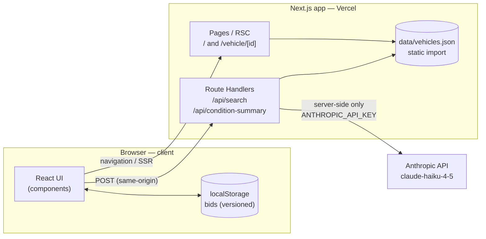
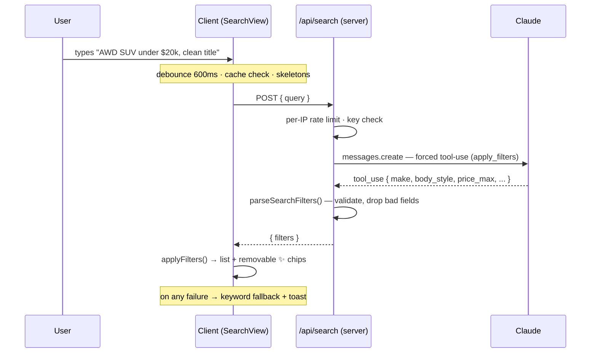
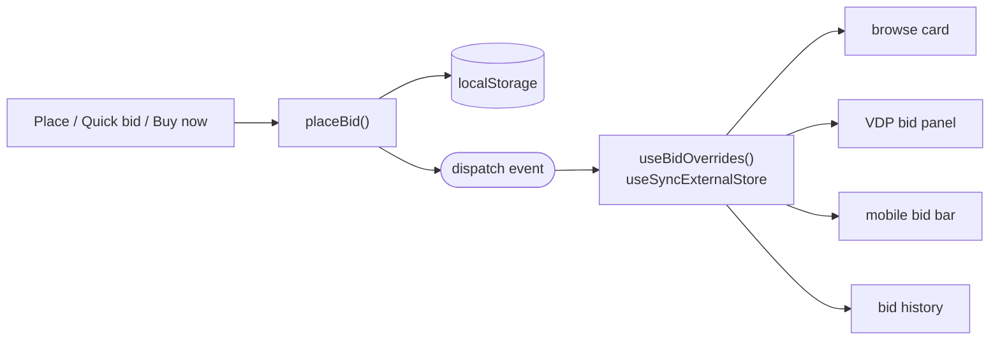

# Architecture

A single **Next.js (App Router)** application deployed to **Vercel only**. The browser talks
to same-origin API routes; those routes are the *only* server code, and they exist purely to
proxy Claude so the API key stays server-side. Vehicle data is a static bundled import; bids
live in the browser's `localStorage`. No database, no auth, no separate backend.

---

## System diagram

The browser **never** calls Anthropic directly — it only calls our own `/api/*` routes, so the
key never reaches the client.

---

## Layers

| Layer | Where | Responsibility |
|-------|-------|----------------|
| **Presentation** | `components/` (`shared` · `layout` · `bidding` · `views/browse` · `views/vehicle`) + `hooks/` | Primitives, app chrome, the bidding domain, and per-page views |
| **Domain logic** | `lib/` | Pure, testable logic: `filters`, `bids`, `auction`, `bidHistory`, `contracts` (types + validators) |
| **Data** | `data/vehicles.json` → `lib/data` | Static import, validated once at load via `isVehicle` |
| **AI proxy** | `app/api/*` + `server/claude` + `server/prompts` | Server-only Claude calls; structured-output prompts |

The domain logic is deliberately framework-free (no React, no I/O), which is why it's the part
that's unit-tested.

---

## How AI search flows

The **condition summary** follows the same shape: the VDP posts a vehicle `id`, the route looks
it up server-side, sends grade + report + damage + title to Claude with a grounded prompt, and
returns plain text (cached per id; skeleton while loading; toast + hide on failure).

---

## Bidding & state

Bids are client-only and reactive across the whole UI:

One write to `localStorage` updates the card, the detail page, the bid bar, and the history at
once — and it's SSR/hydration-safe (the server snapshot is empty). All three entry points
(place / quick / buy-now) funnel through the same validated `placeBid` + `minimumBid` logic.

---

## Key choices & rationale

Full ADRs in [`DECISIONS.md`](DECISIONS.md). The architecturally significant ones:

- **Single Next.js app, not Vite + a separate backend.** The AI features need a server
  boundary to keep the key secret. One app = one deploy, no CORS, simplest clone-and-run.
  *(ADR 0001)*
- **Server-side AI proxy + structured output.** Search forces a Claude *tool call*
  (`apply_filters`), so the model returns JSON, not prose. Every response is then run through a
  runtime validator (`parseSearchFilters`) — **we never trust raw LLM output.**
- **AI is additive, never a dependency.** Rate limit + cache + debounce + graceful fallback
  (keyword search / hide summary) mean the app is fully usable with no key and never breaks if
  a call fails.
- **Static data import** (`data/vehicles.json`) — no DB; the dataset is validated once at load.
  No runtime "data failed to load" path, so `error.tsx` is just a generic safety net.
- **`localStorage` + `useSyncExternalStore`** for bids — reactive across components without a
  state library, and hydration-safe.
- **`force-dynamic` on time-sensitive routes** — auction phases are normalized to "now"
  (ADR 0002), so the anchor is read per request, not frozen at build.
- **Design tokens only in `app/globals.css` `@theme`** (Tailwind v4, CSS-first) — one source of
  truth; see [`design-system.md`](design-system.md).

---

## What this is *not* (deliberate non-goals)

- **No database / no auth** — out of scope; bids are local to the browser.
- **No standalone backend** — the two route handlers only proxy Claude.
- **In-memory rate limit & caches** — fine for a single-instance prototype; a multi-instance
  deploy would move these to a shared store (e.g. Redis).
- **Synthetic auction times & bid history** — reconstructed from the dataset (count + current
  bid), clearly labeled in the UI. *(ADR 0002, 0003)*
